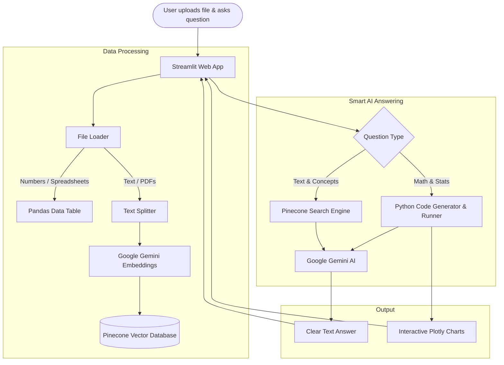

# 🤖 DataSense.AI — Smart Data & Document Assistant

[](https://www.python.org/)
[](https://streamlit.io/)
[](https://ai.google.dev/)
[](https://www.pinecone.io/)
[](https://www.langchain.com/)
[](https://opensource.org/licenses/MIT)

> **DataSense.AI** is an easy-to-use AI assistant for your data and documents. You can upload spreadsheets (CSV, Excel) and text files (PDF, TXT), ask questions in simple English, and get instant answers, calculations, and beautiful charts.

---

## 🎯 Why Did I Build This Project? (Problem & Solution)

### The Problem
Most people deal with two types of data every day:
1. **Numbers in tables:** Sales reports, finance sheets, and inventory files (CSV, Excel).
2. **Text in documents:** PDF books, contracts, notes, and meeting summaries (PDF, TXT).

When people try to use regular AI chatbots to analyze spreadsheets:
* Standard AI models often make basic math mistakes (they guess numbers instead of calculating them).
* Tools like Excel or PowerBI require technical formulas and complex setups.
* Reading long PDF files takes a lot of time, and searching through them manually is difficult.

### The Solution
**DataSense.AI solves this by using two smart systems working together:**
* **For Numbers (Spreadsheets):** When you ask about totals, averages, or trends, the app writes and runs real Python code in the background. This means **every calculation is 100% accurate** with zero guessing.
* **For Text (PDFs and Notes):** The app reads your document, saves it in a fast search database (Pinecone), and finds the exact paragraph you need in seconds.
* **For Visuals:** It automatically makes interactive charts (bar charts, line graphs, heatmaps) so you can easily understand your data.

---

## 🏛️ How It Works (Simple Architecture)



---

## ✨ What Can DataSense.AI Do?

| Feature | How It Helps You |
|---------|------------------|
| 📁 **Upload Multiple File Formats** | Supports CSV, Excel (`.xlsx`, `.xls`), PDF, and TXT files up to 50MB each. |
| 🔢 **Accurate Math Answers** | Uses real Python calculations so numbers and totals are always correct. |
| 🔍 **Fast Document Search** | Finds specific answers and details inside long PDF documents instantly. |
| 📊 **Automatic Charts** | Creates clear, interactive charts with tooltips and zoom features. |
| 💬 **Chat with Memory** | Remembers your previous questions so you can have a natural conversation. |
| ⚡ **Live Typing Response** | Streams answers word-by-word in real time so you don't have to wait. |
| 🎨 **Clean Dark Design** | A modern, distraction-free interface that looks good and is easy to use. |

---

## 📂 Project Folder Structure

```
DataSense.AI/
├── app.py                      # Main application file and UI layout
├── config.py                   # Settings, API configurations, and model names
├── requirements.txt            # List of required Python packages
├── architecture_guide.md       # Technical explanation for developers
├── README.md                   # Project guide and overview
├── .env.example                # Example file for your API keys
│
├── assets/                     # Images and media
│   └── logo.png                # Official DataSense.AI logo
│
├── components/                 # UI parts of the app
│   ├── sidebar.py              # Left sidebar for file uploads and settings
│   ├── chat_interface.py       # Main chat window and message display
│   └── data_display.py         # Table previews and interactive charts
│
├── src/                        # Core backend code
│   ├── data_analyzer.py        # Runs calculations and creates charts with Plotly
│   ├── document_processor.py   # Reads files (PDF, CSV, Excel, TXT) and splits text
│   ├── rag_engine.py           # Connects search results to the AI model
│   ├── vector_store.py         # Stores and searches document text in Pinecone
│   └── utils.py                # Helper tools and file check functions
│
├── prompts/                    # AI instructions
│   └── templates.py            # Friendly prompt messages for the AI model
│
└── data/                       # Test datasets
    └── sample_sales.csv        # Sample sales file to try right away
```

---

## 🛠️ Tools & Technologies Used

* **[Streamlit](https://streamlit.io/):** Python framework used to build the web user interface.
* **[Google Gemini 3.5 Flash-Lite](https://ai.google.dev/):** The main AI language model that explains answers clearly and writes analysis code.
* **[Google Gemini Embeddings](https://ai.google.dev/):** Converts text into smart search points so the system understands word meaning.
* **[Pinecone](https://www.pinecone.io/):** Cloud database that stores and searches through document paragraphs at high speed.
* **[LangChain](https://www.langchain.com/):** Connects the AI models, search database, and prompt templates together.
* **[Pandas & NumPy](https://pandas.pydata.org/):** Handles tables, filtering, sorting, and statistical calculations.
* **[Plotly](https://plotly.com/python/):** Draws interactive charts and graphs.
* **[PyPDF & OpenPyXL](https://pypdf.readthedocs.io/):** Reads PDF files and Excel workbooks cleanly.

---

## 🚀 How to Run the Project Locally

### Step 1: Download the Project
```bash
git clone https://github.com/sonawanewdinesh18/DataSense-AI.git
cd DataSense-AI
```

### Step 2: Create a Virtual Environment (Optional but Recommended)
```bash
# Windows
python -m venv venv
.\venv\Scripts\activate

# Mac / Linux
python3 -m venv venv
source venv/bin/activate
```

### Step 3: Install Required Packages
```bash
pip install -r requirements.txt
```

### Step 4: Add Your Free API Keys
1. Get a free Google Gemini key from [Google AI Studio](https://aistudio.google.com/apikey).
2. Get a free Pinecone key from [Pinecone.io](https://www.pinecone.io/).
3. Make a copy of `.env.example` and name it `.env`:
   ```bash
   copy .env.example .env     # Windows
   cp .env.example .env       # Mac / Linux
   ```
4. Paste your keys inside the `.env` file:
   ```ini
   GOOGLE_API_KEY=your_gemini_key_here
   PINECONE_API_KEY=your_pinecone_key_here
   ```

### Step 5: Start the App
```bash
streamlit run app.py
```
Open your browser and visit: `http://localhost:8501`

---

## 💡 Simple Questions You Can Ask

### If you upload a Spreadsheet (CSV / Excel):
* *"What are the total sales for each category?"*
* *"Show me a bar chart of profit by region."*
* *"Which product sold the most units?"*
* *"Is there any relationship between price and quantity?"*

### If you upload a Document (PDF / TXT):
* *"Can you summarize this document in 5 key bullet points?"*
* *"What does this document say about payment terms or deadlines?"*
* *"Explain the main conclusions from this report."*

---

## 🔒 Privacy & Safety

* **Your Keys Stay Safe:** Your API keys are kept in your local `.env` file and are never shared or committed to GitHub.
* **Separated Files:** Each uploaded document gets its own private space in the database so your documents do not mix with each other.

---

## 📄 License

This project is open source and available under the **MIT License**. Feel free to use and improve it!
