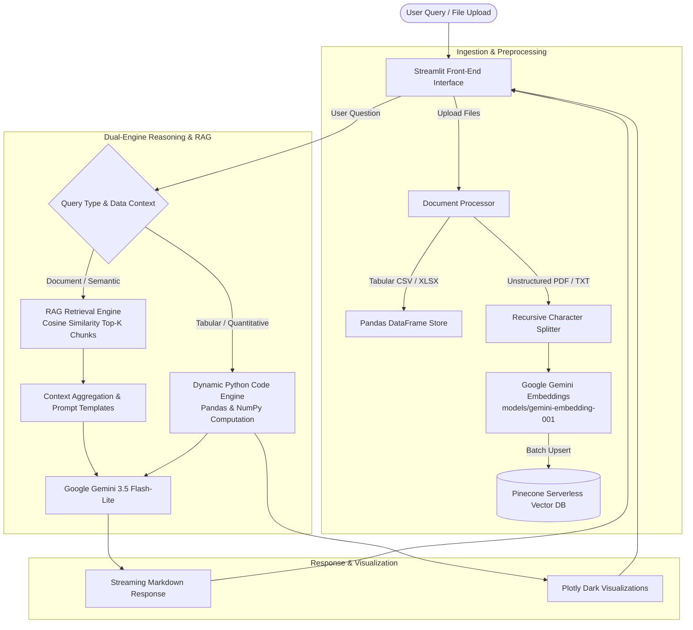

# 🤖 DataSense.AI — Autonomous Data & Document Intelligence Agent

[](https://www.python.org/)
[](https://streamlit.io/)
[](https://ai.google.dev/)
[](https://www.pinecone.io/)
[](https://www.langchain.com/)
[](https://opensource.org/licenses/MIT)

> **DataSense.AI** is an enterprise-grade autonomous data analysis and document intelligence platform. It bridges the gap between **exact statistical calculations on tabular datasets** (CSV, Excel) and **semantic neural retrieval over unstructured documents** (PDF, TXT), delivering natural language querying, automated code generation, and interactive data visualizations within a sleek glassmorphic interface.

---

## 🎯 Why Was This Built? (The Problem We Solved)

In modern organizations, information lives in two disconnected worlds:
1. **Structured Data:** Transaction logs, financial spreadsheets, sales records, and metrics tables (CSV, Excel).
2. **Unstructured Documents:** Business reports, syllabus documents, contracts, documentation, research papers (PDF, TXT).

### The Bottlenecks
* **Traditional RAG (Retrieval-Augmented Generation) Fails at Math:** Feeding raw spreadsheet numbers into a vector database and asking an LLM to compute aggregates (sums, averages, correlations) causes severe hallucinations and arithmetic errors.
* **Traditional BI Dashboards Require Technical Skills:** Non-technical stakeholders struggle with SQL queries, Excel pivot tables, and Python scripts just to discover simple trends or answer routine business questions.
* **Context Switching:** Users have to switch between spreadsheet viewers, PDF readers, and external AI chatbots to synthesize answers across different formats.

### The DataSense.AI Solution
**DataSense.AI** introduces a **Dual-Engine Architecture**:
* **Tabular Engine (Deterministic & Exact):** CSV and Excel files are parsed into Pandas DataFrames. When users query tabular data, the agent dynamically generates Python code and evaluates it directly on the dataset, ensuring **100% mathematical precision** without numerical hallucination.
* **Document RAG Engine (Semantic & Context-Aware):** PDFs and TXT files are chunked into semantic paragraphs, embedded via Google Gemini Embeddings (`models/gemini-embedding-001`, 3072 dimensions), and indexed in Pinecone Serverless Vector DB with isolated per-file namespaces.
* **Visual Synthesis:** Automatically generates interactive Plotly dark-themed charts (bar, line, scatter, box, heatmaps) directly from user queries.

---

## 🏛️ System Architecture



---

## ✨ Key Features

| Capability | Technical Implementation | Benefit |
|------------|--------------------------|---------|
| **Multi-Modal Document Ingestion** | `pypdf`, `openpyxl`, `pandas` | Ingest CSV, Excel, PDF, and plain text files simultaneously up to 50MB per file. |
| **Hallucination-Free Tabular Analysis** | In-memory Pandas execution via `DataAnalyzer` | High-precision statistical calculations (quantiles, correlations, sums) calculated deterministically. |
| **Serverless Semantic Search** | Pinecone Serverless (`aws:us-east-1`) | Fast, persistent, isolated vector searches partitioned by file namespace. |
| **Exponential Backoff & Batching** | Custom rate-limiting batch handler in `vector_store.py` | Handles Google Generative AI free tier limits gracefully without hitting 429 errors. |
| **Interactive Plotly Visualizations** | Plotly Express with `plotly_dark` theme | Dynamic histograms, scatter plots, correlation heatmaps, and category breakdowns. |
| **Conversational Memory** | Sliding memory window with session state | Maintains conversational context across multiple analytical follow-ups. |
| **Real-time Token Streaming** | LangChain Core Streaming Callbacks | Instant feedback with token-by-token response streaming. |
| **Glassmorphism UI** | Custom Vanilla CSS on Streamlit | Dark aesthetic, glowing accents, clean collapsible sidebar, and mobile-friendly responsive layout. |

---

## 📂 Folder Architecture

```
DataSense.AI/
├── app.py                      # Application entry point, layout orchestration & custom styling
├── config.py                   # Centralized configuration (models, thresholds, chunk sizes)
├── requirements.txt            # Minimal production dependencies
├── architecture_guide.md       # Deep-dive architectural specification
├── README.md                   # Project documentation & setup guide
├── .env.example                # Sample environment configuration template
│
├── assets/                     # UI visual assets
│   └── logo.png                # High-resolution transparent DataSense.AI logo
│
├── components/                 # Reusable Streamlit UI modular components
│   ├── chat_interface.py       # Conversational chat view, streaming, and message rendering
│   ├── data_display.py         # Tabular data preview, statistics cards & interactive chart renderers
│   └── sidebar.py              # File uploader, API key validator, active file manager & namespace controls
│
├── src/                        # Core backend business logic & AI pipelines
│   ├── data_analyzer.py        # Tabular data analysis, statistics extraction & Plotly chart generators
│   ├── document_processor.py   # Multi-format document loader, text cleaner & semantic text splitter
│   ├── rag_engine.py           # LangChain RAG pipeline, tabular code generation & query router
│   ├── vector_store.py         # Pinecone index lifecycle, embedding generation with batching & retries
│   └── utils.py                # File validation, base64 asset encoding, file type sniffers
│
├── prompts/                    # Centralized prompt engineering
│   └── templates.py            # RAG system prompts, tabular reasoning templates & welcome copy
│
└── data/                       # Sample datasets for instant evaluation
    └── sample_sales.csv        # Multi-category retail test dataset
```

---

## 🛠️ Tools & Technologies Used

### 1. Artificial Intelligence & RAG
* **[Google Gemini 3.5 Flash-Lite](https://ai.google.dev/):** High-throughput, generous quota conversational LLM delivering structured reasoning with minimal latency.
* **[Google Gemini Embedding (`models/gemini-embedding-001`)](https://ai.google.dev/docs/embeddings_guide):** 3072-dimensional dense embeddings for deep semantic representations of text documents.
* **[Pinecone Serverless](https://www.pinecone.io/):** Managed cloud vector database providing sub-50ms cosine similarity searches with zero infrastructure overhead.
* **[LangChain (v0.3)](https://www.langchain.com/):** Modern LCEL (LangChain Expression Language) for orchestrating prompt chains, document retrievers, and streaming callbacks.

### 2. Data Science & Numerical Computation
* **[Pandas](https://pandas.pydata.org/):** In-memory DataFrame manipulation, grouping, aggregations, and tabular filtering.
* **[NumPy](https://numpy.org/):** Numerical transformations and correlation matrix computations.
* **[Plotly](https://plotly.com/python/):** WebGL-accelerated interactive visualizations with hover tooltips, zoom, and export capabilities.

### 3. File Processing & Parsing
* **[PyPDF](https://pypdf.readthedocs.io/):** Robust PDF extraction with page-level metadata tracking.
* **[OpenPyXL](https://openpyxl.readthedocs.io/):** Native Microsoft Excel (`.xlsx`, `.xls`) workbook and worksheet parser.
* **[Tabulate](https://pypi.org/project/tabulate/):** Pretty-printed Markdown table conversion for LLM context injection.

### 4. Application Framework & Styling
* **[Streamlit](https://streamlit.io/):** Reactive Python web application framework with custom CSS styling, component injection, and session state management.
* **[Python-Dotenv](https://pypi.org/project/python-dotenv/):** Secure environment variable management for API keys and secrets.

---

## 🚀 Getting Started

### Prerequisites
* Python `3.10` or higher
* A free **Google Gemini API Key** from [Google AI Studio](https://aistudio.google.com/apikey)
* A free **Pinecone API Key** from [Pinecone.io](https://www.pinecone.io/)

### Installation Steps

1. **Clone the repository:**
   ```bash
   git clone https://github.com/yourusername/DataSense.AI.git
   cd DataSense.AI
   ```

2. **Create and activate a virtual environment (recommended):**
   ```bash
   # Windows
   python -m venv venv
   .\venv\Scripts\activate

   # Linux / macOS
   python3 -m venv venv
   source venv/bin/activate
   ```

3. **Install dependencies:**
   ```bash
   pip install -r requirements.txt
   ```

4. **Set up environment variables:**
   ```bash
   # Copy the example environment file
   copy .env.example .env     # Windows
   cp .env.example .env       # Linux / macOS
   ```
   Open `.env` and enter your API keys:
   ```ini
   GOOGLE_API_KEY=AIzaSy...
   PINECONE_API_KEY=pcsk_...
   ```

5. **Run the application:**
   ```bash
   streamlit run app.py
   ```
   The application will automatically start and open in your browser at `http://localhost:8501`.

---

## 💡 Example Queries to Try

### On Tabular Data (`sample_sales.csv`)
* *"What is the total revenue and profit across all product categories?"*
* *"Which region generated the highest average sales amount?"*
* *"Show me a bar chart of sales by region."*
* *"Is there any correlation between unit price and units sold?"*
* *"Identify the top 5 customers with the highest spending."*

### On Documents (PDF / TXT)
* *"What are the key prerequisites and grading criteria outlined in this syllabus?"*
* *"Summarize section 4 of the report with bullet points and bold metrics."*
* *"What liabilities or termination clauses are mentioned in the agreement?"*

---

## 🔒 Security & Best Practices

* **API Key Protection:** No API keys are hardcoded. All keys are loaded dynamically using `python-dotenv` and ignored via `.gitignore`.
* **Isolated Vector Namespaces:** Each uploaded file receives an isolated, sanitized Pinecone namespace (`{filename}_{hash}`) preventing cross-document contamination.
* **Stateless Data Handling:** In-memory DataFrames remain scoped to the active Streamlit user session.

---

## 📄 License

This project is licensed under the **MIT License** — see the [LICENSE](LICENSE) file for details.
