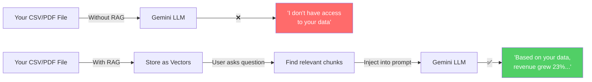
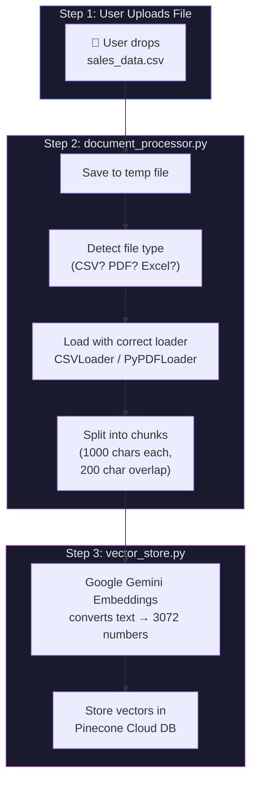
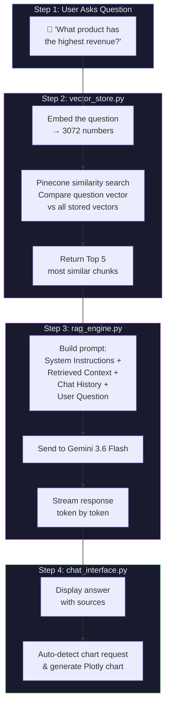
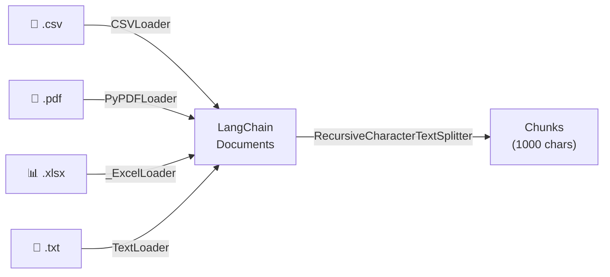
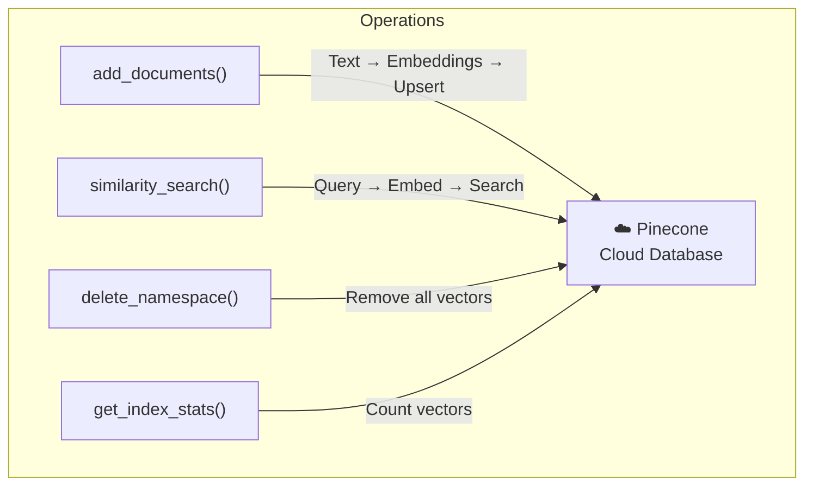
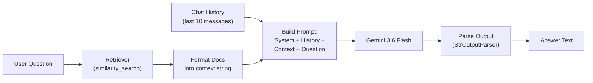
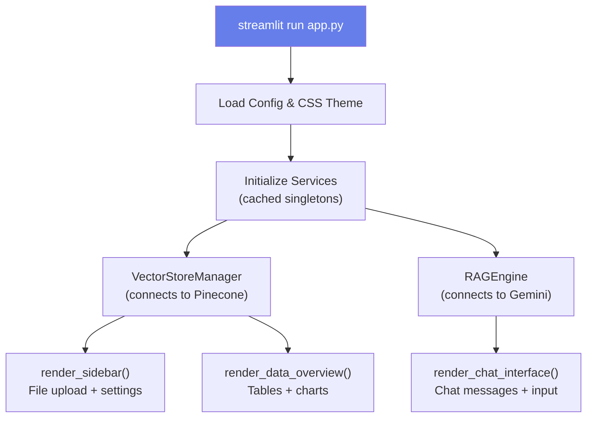
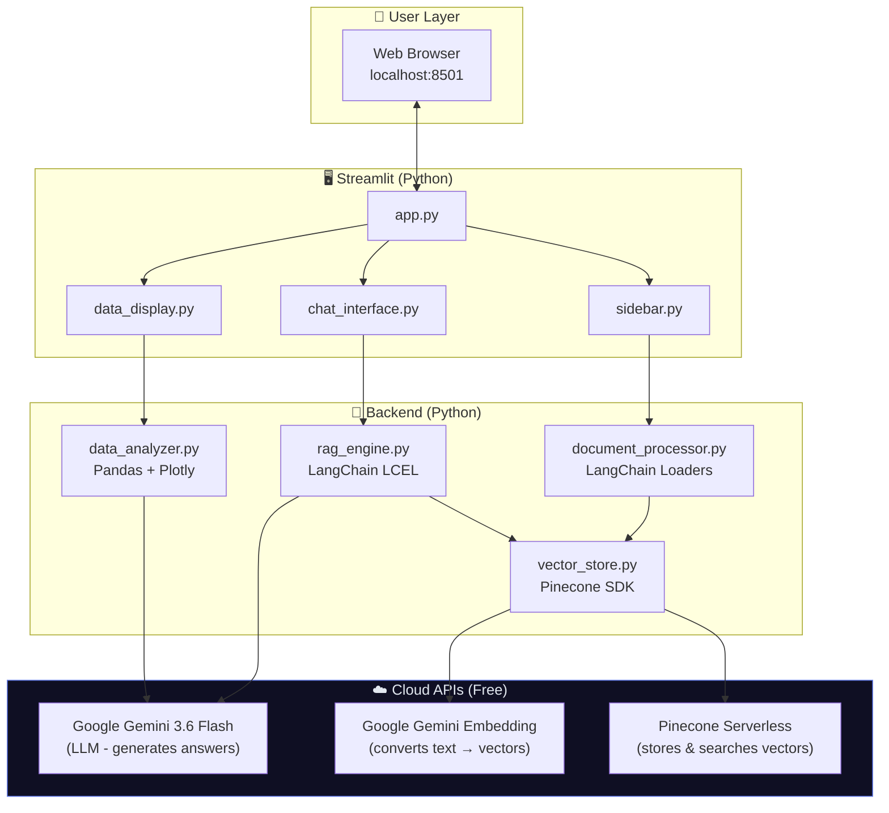

# 🏗️ Data Analysis RAG Agent — Complete Architecture Guide

## 1. What is RAG? (The Core Concept)

**RAG = Retrieval-Augmented Generation**

Without RAG, an LLM (like Gemini) only knows what it was trained on. It has **zero knowledge** of your private data files. RAG solves this by:

1. **Storing** your documents as searchable vectors (numbers)
2. **Retrieving** the most relevant pieces when you ask a question
3. **Augmenting** the LLM's prompt with that context
4. **Generating** an accurate answer grounded in YOUR data



---

## 2. Project Folder Structure (What Each File Does)

```
📁 Data Analysis Agent/
│
├── 📄 app.py                    ← 🚪 ENTRY POINT (start here)
├── 📄 config.py                 ← ⚙️ All settings in one place
├── 📄 .env                      ← 🔑 Your secret API keys
├── 📄 requirements.txt          ← 📦 Python packages needed
│
├── 📁 src/                      ← 🧠 BACKEND (brain of the app)
│   ├── utils.py                 ← 🔧 Helper functions
│   ├── document_processor.py    ← 📄 File loading & chunking
│   ├── vector_store.py          ← 🗄️ Pinecone database operations
│   ├── rag_engine.py            ← 🤖 The RAG chain (retrieval + AI)
│   └── data_analyzer.py         ← 📊 Charts & statistics
│
├── 📁 components/               ← 🖥️ FRONTEND (what user sees)
│   ├── sidebar.py               ← ◀️ Left panel (upload, settings)
│   ├── chat_interface.py        ← 💬 Chat messages & input
│   └── data_display.py          ← 📊 Tables & chart display
│
├── 📁 prompts/                  ← 📝 AI INSTRUCTIONS
│   └── templates.py             ← 🎯 System prompts for Gemini
│
└── 📁 data/                     ← 📂 Sample test files
    └── sample_sales.csv         ← 📈 30-row test dataset
```

---

## 3. Complete Data Flow (Step by Step)

### Phase 1: File Upload → Storage (Ingestion)



**What happens in detail:**

| Step | File | What Happens | Example |
|------|------|-------------|---------|
| 1 | `sidebar.py` | User drops a file in the upload widget | `sales_data.csv` (30 rows) |
| 2 | `document_processor.py` | Saves file to a temp location | `C:\temp\abc123.csv` |
| 3 | `document_processor.py` | Detects file type from extension | `.csv` → use `CSVLoader` |
| 4 | `document_processor.py` | Loads file into LangChain `Document` objects | Each CSV row → one Document |
| 5 | `document_processor.py` | Splits into chunks (1000 chars, 200 overlap) | 30 rows → ~8 chunks |
| 6 | `vector_store.py` | Sends chunk text to Google Embedding API | `"Laptop Pro, $1299..."` → `[0.012, -0.045, 0.891, ...]` (3072 numbers) |
| 7 | `vector_store.py` | Stores vectors + metadata in Pinecone | 8 vectors stored in cloud |

> [!TIP]
> **Why chunk with overlap?** If a sentence spans two chunks, the 200-character overlap ensures the full sentence exists in at least one chunk. This prevents losing context at chunk boundaries.

---

### Phase 2: Question → Answer (Retrieval & Generation)



**What happens in detail:**

| Step | File | What Happens |
|------|------|-------------|
| 1 | `chat_interface.py` | User types question in chat box |
| 2 | `vector_store.py` | Question text → embedded into 3072-dim vector |
| 3 | `vector_store.py` | Pinecone compares question vector vs all stored vectors using **cosine similarity** |
| 4 | `vector_store.py` | Returns Top-5 most relevant chunks |
| 5 | `rag_engine.py` | Builds a prompt: System Instructions + Retrieved Chunks + Chat History + Question |
| 6 | `rag_engine.py` | Sends complete prompt to Google Gemini 3.6 Flash |
| 7 | `rag_engine.py` | Streams response tokens back one by one |
| 8 | `chat_interface.py` | Displays streaming response + source documents |
| 9 | `chat_interface.py` | If question mentions "chart/plot/graph" → triggers `data_analyzer.py` to generate a Plotly chart |

---

## 4. How Each File Works (Deep Dive)

### 📄 [`config.py`](file:///d:/Data%20Analysis%20Agent/config.py) — Central Configuration

```
All settings in ONE place. Nothing is hardcoded elsewhere.
```

| Setting | Value | Purpose |
|---------|-------|---------|
| `LLM_MODEL` | `gemini-3.6-flash` | Which AI model generates answers |
| `EMBEDDING_MODEL` | `gemini-embedding-001` | Which model converts text → vectors |
| `EMBEDDING_DIMENSION` | `3072` | Size of each vector (must match Pinecone index) |
| `CHUNK_SIZE` | `1000` | Max characters per chunk |
| `CHUNK_OVERLAP` | `200` | Characters shared between consecutive chunks |
| `RETRIEVAL_TOP_K` | `5` | How many chunks to retrieve per question |
| `PINECONE_INDEX_NAME` | `data-analysis-agent` | Name of the Pinecone cloud index |

---

### 📄 [`src/document_processor.py`](file:///d:/Data%20Analysis%20Agent/src/document_processor.py) — File Ingestion



- **Auto-detects** file type from extension
- **CSV**: Each row becomes a Document
- **PDF**: Each page becomes a Document
- **Excel**: Custom lightweight loader using `openpyxl` (reads sheets as text)
- **TXT**: Entire file as one Document
- Then **splits** all Documents into ~1000-character chunks with 200-char overlap

---

### 📄 [`src/vector_store.py`](file:///d:/Data%20Analysis%20Agent/src/vector_store.py) — Pinecone Operations



- **Namespaces**: Each uploaded file gets its own namespace (isolated storage)
- **Batching**: Uploads vectors in batches of 50 (Pinecone limit)
- **Metadata**: Stores source filename, chunk index alongside each vector

---

### 📄 [`src/rag_engine.py`](file:///d:/Data%20Analysis%20Agent/src/rag_engine.py) — The Brain

This is where **RAG actually happens**. It uses LangChain's **LCEL (LangChain Expression Language)** to build a processing chain:



**The prompt sent to Gemini looks like this:**

```
SYSTEM: You are an expert Data Analysis Agent. Always base your 
answers on the provided context...

CHAT HISTORY:
Human: What's in this dataset?
AI: This dataset contains 30 rows of sales data...

CONTEXT (from Pinecone):
[Source: sales_data.csv | Chunk 3]
Laptop Pro X2, Electronics, South, 55, 1499.99, 82499.45...

[Source: sales_data.csv | Chunk 7]
Gaming Mouse Pro, Electronics, North, 155, 79.99, 12398.45...

QUESTION: What product has the highest revenue?
```

**Three modes:**
1. `query()` — Full RAG (retrieve + generate), returns complete response
2. `query_stream()` — Same but streams tokens one-by-one (better UX)
3. `query_without_rag()` — Direct LLM call when no files are uploaded

---

### 📄 [`src/data_analyzer.py`](file:///d:/Data%20Analysis%20Agent/src/data_analyzer.py) — Charts & Stats

For **CSV/Excel files only** — loads the file into a Pandas DataFrame and provides:

| Feature | How It Works |
|---------|-------------|
| `get_data_summary()` | Returns shape, dtypes, missing values, top values |
| `auto_generate_charts()` | Auto-creates histogram, bar chart, heatmap, scatter plot |
| `generate_chart_from_query()` | User says *"show bar chart of revenue by category"* → LLM writes Plotly code → code is executed → chart rendered |

---

### 📄 [`prompts/templates.py`](file:///d:/Data%20Analysis%20Agent/prompts/templates.py) — AI Instructions

Contains the **system prompt** that tells Gemini how to behave:
- *"You are an expert Data Analysis Agent"*
- *"Always base answers on the provided context"*
- *"Be precise with numbers"*
- *"Use markdown formatting"*
- *"Cite your sources"*

---

### 📄 [`app.py`](file:///d:/Data%20Analysis%20Agent/app.py) — Main Entry Point



**Key design:**
- `@st.cache_resource` ensures `VectorStoreManager` and `RAGEngine` are created **once** and reused across reruns (Streamlit reruns the entire script on every interaction)
- Custom CSS applies the dark glassmorphism theme

---

## 5. Technology Connections



---

## 6. Key Concept: Embeddings & Similarity Search

This is the **magic** behind RAG:

```
"Laptop Pro costs $1299"  →  [0.82, -0.13, 0.45, ..., 0.67]  (3072 numbers)
"What is the laptop price?" →  [0.79, -0.11, 0.43, ..., 0.65]  (3072 numbers)
                                     ↑ Very similar vectors! ↑
                                     Cosine Similarity = 0.96

"Weather forecast tomorrow" →  [0.12, 0.88, -0.34, ..., 0.02]  (3072 numbers)
                                     ↑ Very different vector ↑
                                     Cosine Similarity = 0.11
```

Pinecone finds the **stored chunks whose vectors are closest** to the question vector. This is how it knows which parts of your data are relevant — even if the exact words don't match!

---

## 7. Summary: One Complete User Journey

```
1. User uploads sales_data.csv
2. document_processor.py loads it → splits into 8 chunks
3. vector_store.py embeds each chunk (Google API) → stores in Pinecone
4. User asks: "What's the top product by revenue?"
5. vector_store.py embeds the question → searches Pinecone → finds 5 relevant chunks
6. rag_engine.py builds prompt: instructions + chunks + question
7. rag_engine.py sends to Gemini 3.6 Flash → streams response
8. chat_interface.py displays: "Based on the data, Laptop Pro X2 has the 
   highest revenue at $82,499.45 from 55 units sold in the South region."
9. User asks: "Show me a bar chart of revenue by category"
10. data_analyzer.py → LLM generates Plotly code → chart rendered in UI
```
